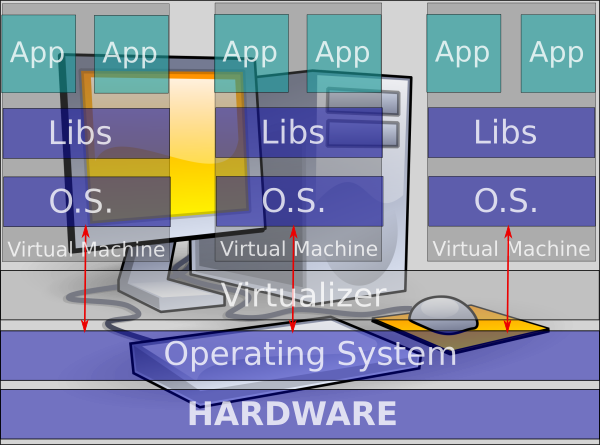

This presentation is an introduction on Kubernetes, a containers orchestrator from Google.
This presentation is showed the 21th June 2016

----

Introduction on Kubernetes
==========================

Torello Querci

June 2016

tquerci@gmail.com

[Online presentation](https://www.torosoft.com/kubernetes/)

[Source code](https://github.com/mk8/presentation-kubernetes-2016/)

----

Agenda
======

* Virtualization
* Linux Containers
* What Kubernetes add to containers
* Q&A

----

Virtualization types
====================

* Full virtualization (qemu, VirtualBox, VMWare, HyperV, ...)
* Paravirtualization (Xen)
* Containers (LXC, Docker, rkt, LXD, ...)

----

Full virtualization
===================

Full machine have to be virtualized so Guest OS doesn't know that it runs in a virtualized environment.


----

Paravirtualization
==================

Guest OS knows it runs as guest so every call attempt to Hardware is routed to Host OS.



----

Container
=========

Container technology creates a "virtual" environment for each App without creating a virtual machine.


----

Container: Virtualization without virtualizator
===============================================

What? A virtualization without virtualizator? How it can be possible?

----

Behind the magic
================

- chroot (file system isolation)
- AppArmor, SELinux (security/access control)
- cgroup (cpu, memory, disk, i/o management - resource management)
- namespace (mnt, pid, net, ipc, userid)

----

What can I do with Containers?
==============================

Containers are a way to create virtual environment for you applications so that your deployment platform can be the same of production environment.

*No More library or operating system version conflicts*

----

LXC
===

LXC (Linux Containers) is an operating-system-level virtualization method for running multiple isolated Linux systems (containers) on a control host using a single Linux kernel. (from Wikipedia)

----

With LXC you can create for example:

* File system server (with samba),
* Web server for developers
* Web server for UI testing group
* CI linked to version control system
* And much more

with different network addresses on the same machine.

----

Docker
======

Docker containers wrap up a piece of software in a complete filesystem
that contains everything it needs to run: code, runtime, system tools, system libraries – anything you can install on a server.
This guarantees that it will always run the same, regardless of the environment it is running in. (from Wikipedia)

----

```

#
# example Dockerfile
#

FROM tech-stack:v0.0.19
MAINTAINER tquerci@gmail.com
EXPOSE 25

# Copy config files
ADD main.conf /etc/postfix/main.cf

# Copy password file
ADD sasl_passwd.conf /etc/postfix/sasl_passwd

# Copy wrapper to start postfix and check if it run
ADD postfix-wrapper.sh /

# Set mail server name
RUN echo "myorg.com" > /etc/mailname

# Run password generator
RUN postmap /etc/postfix/sasl_passwd

# Start Postfix wrapper server
CMD /postfix-wrapper.sh

```
----

How to use Docker
=================

Build an image from the Dockerfile assign it a name.

```
$ docker build -t my_postfix .
```

And run the Postfix server container (in the foreground):

```
$ docker run --rm -P --name pf_test my_postfix
```

----

Docker's registry
=================

You can store your image in a public or private registry so you can download it from *testing*, *staging* or *production* environments.

```
$
$ docker pull ubuntu:14.04
$
```

or

```
$
$ docker pull tonistiigi/dnsdock
$
```

----

Kubernetes
==========

What is Kubernetes?

* Kubernetes is a platform for hosting Docker containers in a clustered environment
* Provides container grouping, load balancing, auto healing, scaling features

----

Key concepts
============

* Master - maintains cluster state and oversees everything
* Node - where your dockers run
* Pod - one or more containers in execution on the same host
* Labels - way to identify pods
* Replication controller - managing replication of pods
* Services - service exposed by pods
* Namespaces - groups all in some ways

----

Master
======

* maintains the state of of the cluster
* runs apiserver docker
* processes request
* data persistence with etcd
* monitors pods heath and maintains right number of running pods for every Replication Controller

----

Node
====

* where your pods run
* runs proxy to access your services
* caching dockers images

----

Pod
===

Can be created manually or using json or yaml description file.

```
apiVersion: v1
kind: Pod
metadata:
  name: nginx
spec:
  containers:
  - name: nginx
    image: nginx
    ports:
    - containerPort: 80
```
----

multiple dockers can be specified in one pod

```
apiVersion: v1
kind: Pod
metadata:
  name: redis-django
  labels:
    app: web
spec:
  containers:
    - name: key-value-store
      image: redis
      ports:
        - containerPort: 6379
    - name: frontend
      image: django
      ports:
        - containerPort: 8000
```
----

Interface with apiserver - kubectl command
==========================================

To view running pods:

```
$ kubectl get po
```
To create a pod:

```
$ kubectl create -f single-pod.yaml
```
To delete a pod:

```
$ kubectl delete -f single-pod.yaml
```

----


Replication Controller
======================

You can specify how many instances of your pod you need

```
apiVersion: v1
kind: ReplicationController
metadata:
  name: nginx
spec:
  replicas: 2
  selector:
    app: nginx
  template:
    metadata:
      name: nginx
      labels:
        app: nginx
    spec:
      containers:
      - name: nginx
        image: nginx
        ports:
        - containerPort: 80
```

----

Replication controller - example
================================

To view running rc:

```
$ kubectl get rc
```

To create a replication controller:

```
$ kubectl create -f replication-controller-sample.yaml
```

To delete a replication controller:

```
$ kubectl delete -f replication-controller-sample.yaml
```

And ... how to scale it:

```
$ kubectl scale --replicas=1 -f replication-controller-sample.yaml
```

----

Service
=======

Is the way to link pods together

Service can be also used to expose ports to external world.

```
apiVersion: v1
kind: Service
metadata:
  name: reverse-proxy-service
  labels:
    app: nginx
    role: demo
spec:
  selector:
    app: nginx
    role: demo
  ports:
    - port: 80
      name: reverse-http-port
  type: LoadBalancer
  loadBalancerIP: <STATIC-IP-FROM-GOOGLE>
```

----

Namespace
=========

You can group all this stuff together so you can have parallel environments with the same configuration with no conflicts

```
apiVersion: v1
kind: Namespace
metadata:
  name: demo
```
----

Questions
=========

----

Thanks ...
